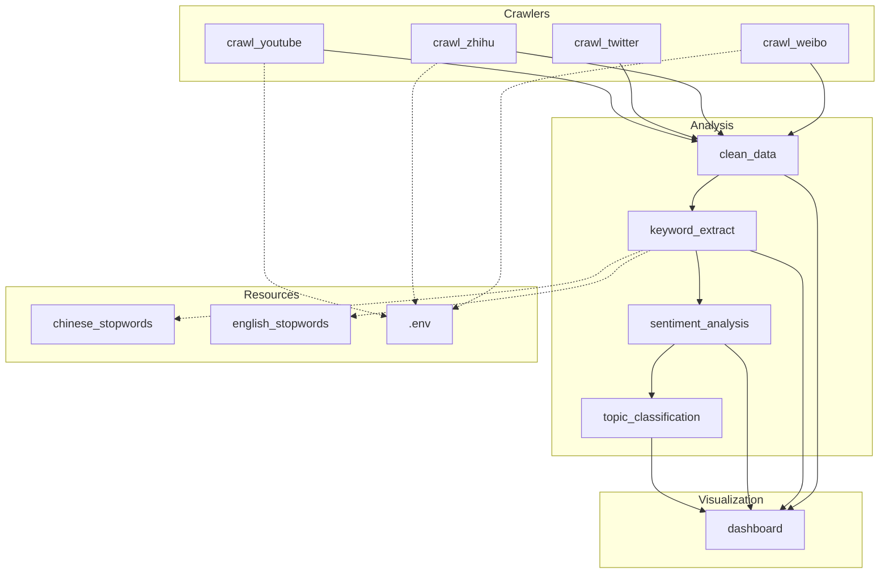

# WarOpinionMining — 项目 Code Wiki

> **文档版本**：v1.0  
> **最后更新**：2026-06-10  
> **项目状态**：框架搭建阶段（核心业务代码待实现）  
> **开发环境**：Python 3.14，Windows  
> **版本控制**：Git（主分支：main）

---

## 目录

1. [项目概述](#1-项目概述)
2. [项目整体架构](#2-项目整体架构)
3. [目录结构详解](#3-目录结构详解)
4. [模块职责与设计规格](#4-模块职责与设计规格)
   - [4.1 爬虫模块 `crawlers/`](#41-爬虫模块-crawlers)
   - [4.2 数据分析模块 `analysis/`](#42-数据分析模块-analysis)
   - [4.3 可视化模块 `visualization/`](#43-可视化模块-visualization)
5. [数据结构与数据流](#5-数据结构与数据流)
6. [依赖关系](#6-依赖关系)
7. [配置管理与环境变量](#7-配置管理与环境变量)
8. [项目运行方式](#8-项目运行方式)
9. [Git 提交历史](#9-git-提交历史)
10. [扩展与维护指南](#10-扩展与维护指南)
11. [代码安全与合规](#11-代码安全与合规)

---

## 1. 项目概述

### 1.1 项目定位

**WarOpinionMining**（战争舆情挖掘系统）是一个基于 Python 的多平台舆情数据采集与分析系统框架。项目旨在从微博、知乎、Twitter（现 X）、YouTube 等主流社交媒体平台采集与国际局势/战争议题相关的用户评论和观点内容，通过自然语言处理技术进行**数据清洗 → 关键词提取 → 情感分析 → 主题分类**，最终以可视化仪表板形式呈现舆情分析结果。

### 1.2 核心功能

| 功能域 | 说明 |
|--------|------|
| 多平台数据采集 | 支持微博、知乎、Twitter、YouTube 四个平台的内容抓取 |
| 数据清洗与预处理 | 去重、去噪、分词、停用词过滤、格式标准化 |
| 关键词提取 | 基于 TF-IDF / TextRank 的中英文关键词自动提取 |
| 情感分析 | 中文（SnowNLP）、英文（TextBlob）情感极性判断 |
| 主题分类 | 基于 Scikit-learn 的文本分类（NB/SVM） |
| 可视化仪表板 | 基于 PyEcharts + Matplotlib + WordCloud 的图表展示 |

### 1.3 项目规模

| 指标 | 数值 |
|------|------|
| Python 模块数 | 9 个（4 爬虫 + 4 分析 + 1 可视化） |
| 外部依赖包 | 16 个 |
| 目标平台数 | 4 个 |
| 支持语言 | 中文、英文 |
| Git 提交数 | 7 次 |

---

## 2. 项目整体架构

### 2.1 四层架构图

```
┌──────────────────────────────────────────────────────────────────────┐
│                      Presentation Layer（展示层）                     │
│   ┌──────────────────────────────────────────────────────────────┐   │
│   │              visualization/dashboard.py                        │   │
│   │      情感饼图 │ 词云图 │ 主题柱状图 │ 时序折线图              │   │
│   └──────────────────────────────────────────────────────────────┘   │
└──────────────────────────────────────────────────────────────────────┘
                                   ▲
                                   │ 分析结果 DataFrame / 图表数据
                                   │
┌──────────────────────────────────────────────────────────────────────┐
│                        Analysis Layer（分析层）                       │
│   ┌──────────────┐   ┌──────────────────┐   ┌─────────────────┐     │
│   │ clean_data   │──▶│ keyword_extract  │──▶│ sentiment       │     │
│   │ .py          │   │ .py              │   │ _analysis.py    │     │
│   │ 数据清洗     │   │ 关键词提取        │   │ 情感分析        │     │
│   └──────────────┘   └──────────────────┘   └────────┬────────┘     │
│                                                      │               │
│                                          ┌───────────▼──────────┐    │
│                                          │ topic_classification │    │
│                                          │ .py   主题分类        │    │
│                                          └──────────────────────┘    │
└──────────────────────────────────────────────────────────────────────┘
                                   ▲
                                   │ 清洗后的 CSV 数据
                                   │
┌──────────────────────────────────────────────────────────────────────┐
│                        Storage Layer（存储层）                        │
│   ┌────────────────┐   ┌──────────────────┐   ┌──────────────────┐   │
│   │ data/raw/      │   │ data/processed/  │   │ data/sample/     │   │
│   │ 原始采集数据   │   │ 清洗后数据       │   │ 示例数据         │   │
│   │ (gitignored)   │   │ (gitignored)     │   │ sample_comments  │   │
│   └────────────────┘   └──────────────────┘   └──────────────────┘   │
└──────────────────────────────────────────────────────────────────────┘
                                   ▲
                                   │ 原始采集数据
                                   │
┌──────────────────────────────────────────────────────────────────────┐
│                       Collection Layer（采集层）                       │
│   ┌──────────┐   ┌───────────┐   ┌────────────┐   ┌─────────────┐   │
│   │ crawl    │   │ crawl     │   │ crawl      │   │ crawl       │   │
│   │ _weibo   │   │ _zhihu    │   │ _twitter   │   │ _youtube    │   │
│   │ .py      │   │ .py       │   │ .py        │   │ .py         │   │
│   └────┬─────┘   └─────┬─────┘   └──────┬─────┘   └──────┬──────┘   │
│        │               │                │                 │           │
│   ┌────▼─────┐    ┌────▼─────┐    ┌─────▼──────┐   ┌─────▼──────┐    │
│   │ 微博 API │    │ 知乎网页 │    │ Twitter    │   │ YouTube    │    │
│   │ SDK      │    │ Cookie   │    │ API/网页   │   │ Data API   │    │
│   └──────────┘    └──────────┘    └────────────┘   └────────────┘    │
└──────────────────────────────────────────────────────────────────────┘
```

### 2.2 层间数据流

```
[各平台 API/网页] ──采集──▶ [data/raw/*.csv] ──清洗──▶ [data/processed/clean.csv]
                                                              │
                              ┌────────────────────────────────┘
                              ▼
                     [关键词提取] ──▶ 关键词表 / 词频矩阵
                              │
                              ▼
                     [情感分析]   ──▶ 情感标签 + 得分
                              │
                              ▼
                     [主题分类]   ──▶ 主题标签
                              │
                              ▼
                     [可视化仪表板] ──▶ HTML 仪表板 / 图表图片
```

### 2.3 技术栈总览

| 层级 | 技术选型 | 版本 |
|------|---------|------|
| 语言 | Python | 3.14 |
| 中文分词 | jieba | - |
| 中文情感 | snownlp | - |
| 英文 NLP | nltk + textblob | - |
| 语言检测 | langdetect | - |
| 数据处理 | pandas | 3.0.3 |
| 机器学习 | scikit-learn | - |
| 可视化 | pyecharts + matplotlib + wordcloud | - |
| 爬虫引擎 | requests + beautifulsoup4 + selenium | - |
| 反爬 | fake-useragent | - |
| YouTube API | google-api-python-client | - |
| 配置管理 | python-dotenv + .env | - |

---

## 3. 目录结构详解

```
WarOpinionMining/                          # 项目根目录
│
├── analysis/                              # ── 数据分析模块 ──
│   ├── clean_data.py                      #    数据清洗与预处理（空，待实现）
│   ├── keyword_extract.py                 #    关键词提取（空，待实现）
│   ├── sentiment_analysis.py              #    情感分析（空，待实现）
│   └── topic_classification.py            #    主题分类（空，待实现）
│
├── crawlers/                              # ── 爬虫模块 ──
│   ├── crawl_weibo.py                     #    微博内容采集（空，待实现）
│   ├── crawl_zhihu.py                     #    知乎内容采集（空，待实现）
│   ├── crawl_twitter.py                   #    Twitter/X 内容采集（空，待实现）
│   └── crawl_youtube.py                   #    YouTube 评论采集（空，待实现）
│
├── data/                                  # ── 数据存储 ──
│   ├── raw/                               #    原始采集数据（gitignored）
│   ├── processed/                         #    处理后数据（gitignored）
│   └── sample/                            #    示例数据
│       └── sample_comments.csv            #     样例评论数据（6条）
│
├── docs/                                  # ── 文档 ──
│   ├── development_log.md                 #    开发日志（空，待编写）
│   ├── report_outline.md                  #    报告大纲（空，待编写）
│   └── code_wiki.md                       #    本项目 Code Wiki
│
├── stopwords/                             # ── 停用词库 ──
│   ├── chinese_stopwords.txt              #    中文停用词表（空，待填充）
│   └── english_stopwords.txt              #    英文停用词表（空，待填充）
│
├── visualization/                         # ── 可视化模块 ──
│   └── dashboard.py                       #    数据可视化仪表板（空，待实现）
│
├── .env.example                           # 环境变量模板（4项配置）
├── .gitignore                             # Git 忽略规则（9条）
├── README.md                              # 项目简介
└── requirements.txt                       # Python 依赖清单（16项）
```

> **说明**：被 `.gitignore` 忽略的目录（`data/raw/`、`data/processed/`、`output/`）目前尚不存在于仓库中，为运行时动态创建的目录。

---

## 4. 模块职责与设计规格

### 4.1 爬虫模块 `crawlers/`

爬虫模块负责从四个不同平台采集原始舆情数据，每个爬虫针对各自平台的 API 或网页结构设计独立的采集逻辑。**统一输出格式**为 CSV 文件（见 [§5](#5-数据结构与数据流)）。

#### 4.1.1 `crawl_weibo.py` — 微博爬虫

| 属性 | 值 |
|------|-----|
| **文件路径** | [crawl_weibo.py](file:///d:/Code/python/WarOpinionMining/crawlers/crawl_weibo.py) |
| **状态** | 🔴 未实现（0 字节） |
| **采集目标** | 微博平台中含特定关键词的帖子与评论 |
| **认证方式** | 微博开放平台 API（需 `WEIBO_APP_KEY` + `WEIBO_APP_SECRET`） |
| **预期输出** | `data/raw/weibo_comments.csv` |

**设计中的核心函数**：

| 函数名 | 可见性 | 参数 | 返回值 | 功能 |
|--------|--------|------|--------|------|
| `search_posts(keyword, count)` | 公开 | keyword: str, count: int | list[dict] | 按关键词搜索微博帖子 |
| `get_comments(post_id, count)` | 公开 | post_id: str, count: int | list[dict] | 获取指定帖子的评论列表 |
| `save_to_csv(data, output_path)` | 内部 | data: list[dict], output_path: str | None | 将采集数据写入 CSV |
| `main()` | 入口 | - | - | 脚本主入口，串联采集流程 |

---

#### 4.1.2 `crawl_zhihu.py` — 知乎爬虫

| 属性 | 值 |
|------|-----|
| **文件路径** | [crawl_zhihu.py](file:///d:/Code/python/WarOpinionMining/crawlers/crawl_zhihu.py) |
| **状态** | 🔴 未实现（0 字节） |
| **采集目标** | 知乎平台中相关话题下的回答与评论 |
| **认证方式** | Cookie 模拟登录（需 `ZHIHU_COOKIE`） |
| **预期输出** | `data/raw/zhihu_comments.csv` |

**设计中的核心函数**：

| 函数名 | 可见性 | 参数 | 返回值 | 功能 |
|--------|--------|------|--------|------|
| `search_answers(query, count)` | 公开 | query: str, count: int | list[dict] | 按话题搜索知乎回答 |
| `get_answer_comments(answer_id)` | 公开 | answer_id: str | list[dict] | 获取回答下的评论 |
| `save_to_csv(data, output_path)` | 内部 | data: list[dict], output_path: str | None | 将采集数据写入 CSV |
| `main()` | 入口 | - | - | 脚本主入口 |

---

#### 4.1.3 `crawl_twitter.py` — Twitter/X 爬虫

| 属性 | 值 |
|------|-----|
| **文件路径** | [crawl_twitter.py](file:///d:/Code/python/WarOpinionMining/crawlers/crawl_twitter.py) |
| **状态** | 🔴 未实现（0 字节） |
| **采集目标** | Twitter/X 中含特定话题标签的推文 |
| **认证方式** | Twitter API（或 Selenium 网页采集） |
| **预期输出** | `data/raw/twitter_comments.csv` |

**设计中的核心函数**：

| 函数名 | 可见性 | 参数 | 返回值 | 功能 |
|--------|--------|------|--------|------|
| `search_tweets(keyword, count)` | 公开 | keyword: str, count: int | list[dict] | 按关键词搜索推文 |
| `get_replies(tweet_id)` | 公开 | tweet_id: str | list[dict] | 获取推文的回复 |
| `save_to_csv(data, output_path)` | 内部 | data: list[dict], output_path: str | None | 将采集数据写入 CSV |
| `main()` | 入口 | - | - | 脚本主入口 |

---

#### 4.1.4 `crawl_youtube.py` — YouTube 爬虫

| 属性 | 值 |
|------|-----|
| **文件路径** | [crawl_youtube.py](file:///d:/Code/python/WarOpinionMining/crawlers/crawl_youtube.py) |
| **状态** | 🔴 未实现（0 字节） |
| **采集目标** | YouTube 视频评论区的内容 |
| **认证方式** | YouTube Data API v3（需 `YOUTUBE_API_KEY`） |
| **依赖包** | `google-api-python-client` |
| **预期输出** | `data/raw/youtube_comments.csv` |

**设计中的核心函数**：

| 函数名 | 可见性 | 参数 | 返回值 | 功能 |
|--------|--------|------|--------|------|
| `search_videos(query, count)` | 公开 | query: str, count: int | list[dict] | 按查询搜索视频 |
| `get_comments(video_id, count)` | 公开 | video_id: str, count: int | list[dict] | 获取视频的顶级评论 |
| `get_replies(parent_id)` | 公开 | parent_id: str | list[dict] | 获取评论的回复 |
| `save_to_csv(data, output_path)` | 内部 | data: list[dict], output_path: str | None | 将采集数据写入 CSV |
| `main()` | 入口 | - | - | 脚本主入口 |

---

### 4.2 数据分析模块 `analysis/`

分析模块为四阶段流水线：**清洗 → 关键词 → 情感 → 主题**，每阶段接收前一步骤的输出，向下传递分析结果。

#### 4.2.1 `clean_data.py` — 数据清洗与预处理

| 属性 | 值 |
|------|-----|
| **文件路径** | [clean_data.py](file:///d:/Code/python/WarOpinionMining/analysis/clean_data.py) |
| **状态** | 🔴 未实现（0 字节） |
| **输入** | `data/raw/*.csv`（多平台原始数据） |
| **输出** | `data/processed/clean_data.csv` |

**核心流程**：

```
原始 CSV 读取
    │
    ▼
[Deduplication] ── 基于 content 字段去重
    │
    ▼
[Text Cleaning] ── HTML 标签去除、特殊字符清理、Emoji 统一化
    │
    ▼
[Missing Value] ── 空值行过滤 / 填充
    │
    ▼
[Format Std]    ── 时间格式统一为 YYYY-MM-DD，类型校验
    │
    ▼
输出 → data/processed/clean_data.csv
```

**设计中的核心函数**：

| 函数名 | 可见性 | 参数 | 返回值 | 功能 |
|--------|--------|------|--------|------|
| `load_data(file_pattern)` | 公开 | file_pattern: str | pd.DataFrame | 加载指定模式的 CSV 文件并合并 |
| `clean_text(text)` | 内部 | text: str | str | 清洗单条文本（去HTML标签、特殊字符） |
| `remove_duplicates(df)` | 内部 | df: pd.DataFrame | pd.DataFrame | 按内容去重 |
| `handle_missing(df)` | 内部 | df: pd.DataFrame | pd.DataFrame | 缺失值处理 |
| `standardize_format(df)` | 内部 | df: pd.DataFrame | pd.DataFrame | 格式标准化 |
| `run_pipeline(input_dir, output_path)` | 公开 | input_dir: str, output_path: str | pd.DataFrame | 执行完整清洗流水线 |
| `main()` | 入口 | - | - | 脚本主入口 |

---

#### 4.2.2 `keyword_extract.py` — 关键词提取

| 属性 | 值 |
|------|-----|
| **文件路径** | [keyword_extract.py](file:///d:/Code/python/WarOpinionMining/analysis/keyword_extract.py) |
| **状态** | 🔴 未实现（0 字节） |
| **输入** | `data/processed/clean_data.csv` |
| **输出** | 关键词频次 DataFrame，用于词云和趋势分析 |
| **依赖** | `jieba`（中文分词）、`nltk`（英文分词） |

**核心流程**：

```
清洗后文本
    │
    ▼
[Lang Detect] ── 使用 langdetect 判断文本语言
    │
    ├── 中文分支 ── jieba 分词 → 加载 chinese_stopwords.txt → TF-IDF/TextRank
    │
    └── 英文分支 ── nltk 分词  → 加载 english_stopwords.txt  → TF-IDF/TextRank
    │
    ▼
关键词 DataFrame（word, freq, platform, 日期）
```

**设计中的核心函数**：

| 函数名 | 可见性 | 参数 | 返回值 | 功能 |
|--------|--------|------|--------|------|
| `detect_language(text)` | 内部 | text: str | str ('zh'\|'en') | 检测文本语言 |
| `segment_chinese(text)` | 内部 | text: str | list[str] | jieba中文分词+去停用词 |
| `segment_english(text)` | 内部 | text: str | list[str] | nltk英文分词+去停用词 |
| `extract_tfidf(texts, top_k)` | 内部 | texts: list[str], top_k: int | list[tuple] | TF-IDF关键词提取 |
| `extract_textrank(texts, top_k)` | 内部 | texts: list[str], top_k: int | list[tuple] | TextRank关键词提取 |
| `load_stopwords(lang)` | 内部 | lang: str | set[str] | 加载对应语言的停用词表 |
| `extract_keywords(df, method)` | 公开 | df: pd.DataFrame, method: str | pd.DataFrame | 执行关键词提取主流程 |
| `main()` | 入口 | - | - | 脚本主入口 |

---

#### 4.2.3 `sentiment_analysis.py` — 情感分析

| 属性 | 值 |
|------|-----|
| **文件路径** | [sentiment_analysis.py](file:///d:/Code/python/WarOpinionMining/analysis/sentiment_analysis.py) |
| **状态** | 🔴 未实现（0 字节） |
| **输入** | `data/processed/clean_data.csv` |
| **输出** | 带情感标签和得分的数据表 |
| **依赖** | `snownlp`（中文情感）、`textblob`（英文情感）、`langdetect`（语言检测） |

**核心流程**：

```
清洗后文本
    │
    ▼
[Lang Detect] ── 每条文本的语言识别
    │
    ├── 中文 → SnowNLP.sentiments → sentiment_score [0,1] → 映射为 positive/negative/neutral
    │
    └── 英文 → TextBlob.sentiment.polarity → [-1,1] → 映射为 positive/negative/neutral
    │
    ▼
附加列：sentiment_label, sentiment_score
```

**设计中的核心函数**：

| 函数名 | 可见性 | 参数 | 返回值 | 功能 |
|--------|--------|------|--------|------|
| `analyze_chinese(text)` | 内部 | text: str | tuple(str, float) | SnowNLP中文情感分析 |
| `analyze_english(text)` | 内部 | text: str | tuple(str, float) | TextBlob英文情感分析 |
| `classify_polarity(score, lang)` | 内部 | score: float, lang: str | str | 将得分映射为 positive/negative/neutral |
| `analyze_sentiment(df)` | 公开 | df: pd.DataFrame | pd.DataFrame | 批量情感分析主函数 |
| `summary_stats(df)` | 公开 | df: pd.DataFrame | dict | 情感分布统计摘要 |
| `main()` | 入口 | - | - | 脚本主入口 |

---

#### 4.2.4 `topic_classification.py` — 主题分类

| 属性 | 值 |
|------|-----|
| **文件路径** | [topic_classification.py](file:///d:/Code/python/WarOpinionMining/analysis/topic_classification.py) |
| **状态** | 🔴 未实现（0 字节） |
| **输入** | 清洗后的文本数据 + 可选标注数据 |
| **输出** | 带主题标签的数据表 |
| **依赖** | `scikit-learn`（分类器）、`jieba` / `nltk`（特征提取） |

**设计中的分类维度**：政治（Political）、经济（Economic）、军事（Military）、人道主义（Humanitarian）、其他（Other）

**核心流程**：

```
清洗后文本
    │
    ▼
[Feature Extraction] ── TF-IDF 向量化（中英文分别处理）
    │
    ▼
[Classifier] ── 朴素贝叶斯 / SVM 分类（有监督，需标注训练数据）
    │
    ▼
附加列：topic_label, topic_confidence
```

**设计中的核心函数**：

| 函数名 | 可见性 | 参数 | 返回值 | 功能 |
|--------|--------|------|--------|------|
| `extract_features(texts)` | 内部 | texts: list[str] | sparse matrix | TF-IDF特征向量化 |
| `train_model(X, y)` | 内部 | X: matrix, y: list[str] | model | 训练分类器（NB/SVM） |
| `predict_topics(texts, model)` | 内部 | texts: list[str], model | list[str] | 预测文本主题 |
| `load_training_data(path)` | 内部 | path: str | tuple | 加载标注训练数据 |
| `classify_topics(df, model_path)` | 公开 | df: pd.DataFrame, model_path: str | pd.DataFrame | 批量主题分类主函数 |
| `main()` | 入口 | - | - | 脚本主入口 |

---

### 4.3 可视化模块 `visualization/`

#### 4.3.1 `dashboard.py` — 可视化仪表板

| 属性 | 值 |
|------|-----|
| **文件路径** | [dashboard.py](file:///d:/Code/python/WarOpinionMining/visualization/dashboard.py) |
| **状态** | 🔴 未实现（0 字节） |
| **输入** | 分析模块的全部输出数据 |
| **输出** | 交互式仪表板 HTML / 静态图表 PNG |
| **依赖** | `pyecharts`、`matplotlib`、`wordcloud` |

**设计中的图表类型**：

| 图表名称 | 类型 | 展示内容 | 使用库 |
|----------|------|----------|--------|
| 情感分布饼图 | 饼图 | 正面/负面/中性占比 | pyecharts |
| 关键词词云 | 词云 | 高频关键词可视化 | wordcloud |
| 平台情感对比 | 柱状图 | 各平台情感分布对比 | pyecharts |
| 时间趋势折线图 | 折线图 | 情感随时间变化趋势 | pyecharts |
| 主题分布图 | 柱状图 | 各主题的帖子/评论数量 | pyecharts |

**设计中的核心函数**：

| 函数名 | 可见性 | 参数 | 返回值 | 功能 |
|--------|--------|------|--------|------|
| `plot_sentiment_pie(df)` | 公开 | df: pd.DataFrame | Chart | 生成情感分布饼图 |
| `plot_wordcloud(texts)` | 公开 | texts: list[str] | Image | 生成关键词词云图 |
| `plot_platform_comparison(df)` | 公开 | df: pd.DataFrame | Chart | 生成平台情感对比柱状图 |
| `plot_time_trend(df)` | 公开 | df: pd.DataFrame | Chart | 生成时间趋势折线图 |
| `plot_topic_distribution(df)` | 公开 | df: pd.DataFrame | Chart | 生成主题分布图 |
| `render_dashboard(*charts)` | 公开 | charts: tuple | str (HTML path) | 组装并渲染完整仪表板 |
| `main()` | 入口 | - | - | 脚本主入口 |

---

## 5. 数据结构与数据流

### 5.1 原始数据格式（统一 Schema）

所有爬虫输出的 CSV 文件遵循统一的字段规范：

| 字段名 | 数据类型 | 是否必填 | 说明 | 示例值 |
|--------|----------|----------|------|--------|
| `platform` | string | ✅ | 数据来源平台 | `微博`、`知乎`、`Twitter`、`YouTube` |
| `keyword` | string | ✅ | 搜索使用的关键词 | `国际局势`、`war` |
| `content` | string | ✅ | 评论文本内容 | `希望和平谈判早日达成` |
| `publish_time` | datetime | ✅ | 发布时间（格式：YYYY-MM-DD） | `2025-05-01` |
| `user_name` | string | ✅ | 发布者用户名 | `用户001` |
| `like_count` | integer | ✅ | 点赞数 | `125` |

### 5.2 示例数据

项目中已包含 6 条跨平台示例数据，位于 [sample_comments.csv](file:///d:/Code/python/WarOpinionMining/data/sample/sample_comments.csv)：

| platform | keyword | content | publish_time | user_name | like_count |
|----------|---------|---------|-------------|-----------|------------|
| 微博 | 国际局势 | 这个事件影响深远，值得持续关注 | 2025-05-01 | 用户001 | 125 |
| 知乎 | 国际局势 | 各方表态差异很大，理性看待需谨慎 | 2025-05-02 | 答主A | 892 |
| YouTube | war | This conflict brings huge economic loss | 2025-05-03 | UserEn1 | 368 |
| 微博 | 国际局势 | 希望和平谈判早日达成 | 2025-05-03 | 用户002 | 361 |
| 知乎 | 国际局势 | 地缘政治变化会改变全球格局 | 2025-05-04 | 答主B | 557 |
| YouTube | war | People desire peace instead of endless fighting | 2025-05-04 | UserEn2 | 215 |

### 5.3 处理后数据扩充字段

分析流水线执行后，每条记录将增加以下计算字段：

| 阶段 | 新增字段 | 类型 | 说明 |
|------|----------|------|------|
| 清洗 | `clean_content` | string | 清洗后的文本内容 |
| 清洗 | `word_count` | int | 有效词数 |
| 关键词 | `keywords` | list[string] | 提取的关键词列表 |
| 情感 | `sentiment_label` | string | 情感标签（positive/negative/neutral） |
| 情感 | `sentiment_score` | float | 情感得分 |
| 主题 | `topic_label` | string | 主题分类标签 |
| 主题 | `topic_confidence` | float | 分类置信度 |

---

## 6. 依赖关系

### 6.1 完整依赖清单

| 序号 | 包名 | 用途 | 所属模块 |
|------|------|------|----------|
| 1 | `pandas` | 数据处理与分析（DataFrame 操作） | 全模块 |
| 2 | `jieba` | 中文分词与关键词提取 | keyword_extract, topic_classification |
| 3 | `snownlp` | 中文情感分析 | sentiment_analysis |
| 4 | `pyecharts` | 交互式数据可视化图表 | dashboard |
| 5 | `wordcloud` | 词云图生成 | dashboard |
| 6 | `matplotlib` | 基础图表绘制 | dashboard |
| 7 | `nltk` | 英文自然语言处理工具包 | keyword_extract, topic_classification |
| 8 | `textblob` | 英文情感分析 | sentiment_analysis |
| 9 | `requests` | HTTP 请求库 | 全部爬虫 |
| 10 | `beautifulsoup4` | HTML/XML 解析器 | crawl_zhihu, crawl_twitter |
| 11 | `selenium` | 动态网页渲染与自动化 | crawl_zhihu, crawl_twitter |
| 12 | `fake-useragent` | 随机 User-Agent 生成（反爬） | 全部爬虫 |
| 13 | `langdetect` | 文本语言自动检测 | keyword_extract, sentiment_analysis |
| 14 | `scikit-learn` | 机器学习（TF-IDF、分类器） | keyword_extract, topic_classification |
| 15 | `google-api-python-client` | YouTube Data API v3 封装 | crawl_youtube |
| 16 | `python-dotenv` | `.env` 环境变量加载 | 全模块 |

### 6.2 依赖分类树

```
requirements.txt
├── 🔧 数据处理
│   └── pandas (3.0.3)
│
├── 🌐 爬虫引擎
│   ├── requests
│   ├── beautifulsoup4
│   ├── selenium
│   └── fake-useragent
│
├── 🇨🇳 中文 NLP
│   ├── jieba          (分词)
│   └── snownlp        (情感分析)
│
├── 🇬🇧 英文 NLP
│   ├── nltk           (分词/词性标注)
│   ├── textblob       (情感分析)
│   └── langdetect     (语言检测)
│
├── 🤖 机器学习
│   └── scikit-learn   (TF-IDF向量化 / 分类器)
│
├── 📊 可视化
│   ├── pyecharts      (交互式图表)
│   ├── wordcloud      (词云)
│   └── matplotlib     (静态图表)
│
├── 🔌 API 集成
│   └── google-api-python-client  (YouTube API)
│
└── ⚙️ 配置
    └── python-dotenv  (环境变量管理)
```

### 6.3 模块间依赖关系图



> 实线箭头表示**数据流依赖**（前一模块的输出是后一模块的输入）；  
> 虚线箭头表示**配置/资源依赖**。

---

## 7. 配置管理与环境变量

### 7.1 环境变量模板

文件：[.env.example](file:///d:/Code/python/WarOpinionMining/.env.example)

```env
WEIBO_APP_KEY=your_weibo_app_key
WEIBO_APP_SECRET=your_weibo_app_secret
ZHIHU_COOKIE=your_zhihu_cookie
YOUTUBE_API_KEY=your_youtube_api_key
```

### 7.2 变量说明

| 变量名 | 用途 | 使用模块 | 获取方式 |
|--------|------|----------|----------|
| `WEIBO_APP_KEY` | 微博开放平台应用 Key | crawl_weibo | [微博开放平台](https://open.weibo.com/) |
| `WEIBO_APP_SECRET` | 微博开放平台应用 Secret | crawl_weibo | 同上 |
| `ZHIHU_COOKIE` | 知乎登录态 Cookie | crawl_zhihu | 浏览器开发者工具中获取 |
| `YOUTUBE_API_KEY` | YouTube Data API 密钥 | crawl_youtube | [Google Cloud Console](https://console.cloud.google.com/) |

### 7.3 使用方式

```bash
# 1. 复制模板
cp .env.example .env

# 2. 编辑 .env 填入真实的 API 密钥
# 3. 在 Python 代码中通过 python-dotenv 加载
```

> ⚠️ **安全提醒**：`.env` 文件已在 `.gitignore` 中排除，切勿将含真实密钥的 `.env` 文件提交到版本控制。

---

## 8. 项目运行方式

### 8.1 环境准备

```bash
# 1. 克隆项目
git clone <repository-url>
cd WarOpinionMining

# 2. 创建虚拟环境（推荐）
python -m venv .venv

# 3. 激活虚拟环境
# Windows:
.venv\Scripts\activate
# Linux/macOS:
source .venv/bin/activate

# 4. 安装依赖
pip install -r requirements.txt

# 5. 配置环境变量
cp .env.example .env
# 编辑 .env 填入 API 密钥
```

### 8.2 数据采集流程

```bash
# 按需运行各平台爬虫
python crawlers/crawl_weibo.py      # 采集微博数据
python crawlers/crawl_zhihu.py      # 采集知乎数据
python crawlers/crawl_twitter.py    # 采集 Twitter 数据
python crawlers/crawl_youtube.py    # 采集 YouTube 数据

# 输出位置：data/raw/<platform>_comments.csv
```

### 8.3 数据分析流程

```bash
# 按顺序执行分析流水线
python analysis/clean_data.py             # Step 1: 数据清洗
python analysis/keyword_extract.py        # Step 2: 关键词提取
python analysis/sentiment_analysis.py     # Step 3: 情感分析
python analysis/topic_classification.py   # Step 4: 主题分类
```

### 8.4 可视化展示

```bash
python visualization/dashboard.py
# 输出：交互式 HTML 仪表板 / 静态图表
```

### 8.5 一键运行脚本（建议实现）

```bash
# 推荐后续添加 run_all.sh / run_all.bat 一键执行全流程
# 或使用 workflow 编排工具（如 Apache Airflow / Prefect）
```

---

## 9. Git 提交历史

| 提交 Hash | 日期 | 说明 | 影响文件 |
|-----------|------|------|----------|
| `502fd7f` | 2026-06-10 | Delete .idea directory | .idea/（删除） |
| `7d82f0b` | 2026-06-10 | 增加了.gitignore内容 | .gitignore（添加 .venv/ .idea/） |
| `43b20c8` | 2026-06-10 | 修改了requirements.txt | requirements.txt（重构依赖清单） |
| `4bf0696` | 2026-06-10 | 新增了.gitignore内容 | .gitignore |
| `935320c` | 2026-06-01 | 创建项目结构，等待后续开发 | 17个文件（骨架搭建） |
| `0afde08` | 2026-05-31 | null | .idea/（IDE配置初始化） |
| `538e3e4` | - | Initial commit | 初始提交 |

### 9.1 关键变更说明

- **`935320c`**：项目骨架创建的里程碑提交。一次性创建了全部目录结构和空模块文件，定义了项目整体架构。原生 `requirements.txt` 包含 10 个包（requests, beautifulsoup4, pandas, numpy, matplotlib, seaborn, pyecharts, snownlp, scikit-learn, python-dotenv）。
- **`43b20c8`**：依赖重构。移除了 `numpy`、`seaborn`（不再需要的重量级依赖），新增 `jieba`、`wordcloud`、`nltk`、`textblob`、`selenium`、`fake-useragent`、`langdetect`、`google-api-python-client`，重新纳入 `requests` 和 `beautifulsoup4`，构建了当前 16 项依赖的最终形态。

---

## 10. 扩展与维护指南

### 10.1 添加新的数据源平台

1. 在 `crawlers/` 下创建 `crawl_<platform>.py`
2. 实现以下核心函数接口：
   - `search_*(keyword, count)` — 搜索/采集功能
   - `get_comments(id)` — 获取评论/回复
   - `save_to_csv(data, path)` — 统一 CSV 输出
3. 在 `.env.example` 中添加新的 API 密钥配置（如需要）
4. 在 `requirements.txt` 中添加新依赖（如需要）
5. 更新本文档

### 10.2 添加新的分析能力

1. 在 `analysis/` 下创建新的 `.py` 文件
2. 输入数据格式需兼容已有流水线的输出 DataFrame
3. 建议在 `main()` 函数中提供独立运行入口
4. 更新本文档中的模块职责部分

### 10.3 停用词管理

- **中文停用词**：[chinese_stopwords.txt](file:///d:/Code/python/WarOpinionMining/stopwords/chinese_stopwords.txt)（空，待填充）
- **英文停用词**：[english_stopwords.txt](file:///d:/Code/python/WarOpinionMining/stopwords/english_stopwords.txt)（空，待填充）
- 每行一个停用词，以换行符分隔
- 建议从公开停用词库导入（如哈工大停用词表、NLTK stopwords corpus）

### 10.4 训练数据准备

`topic_classification.py` 模块需要带标签的训练数据才能运行有监督分类。推荐的准备方式：

1. 对部分采集数据进行人工标注（标注为对应主题）
2. 存储为 CSV 格式：`text, label`
3. 使用 `scikit-learn` 的 `train_test_split` 划分训练/测试集

---

## 11. 代码安全与合规

### 11.1 API 密钥安全

| 规则 | 说明 |
|------|------|
| 不硬编码 | 所有密钥通过 `os.getenv()` 从环境变量读取 |
| 不入库 | `.env` 已加入 `.gitignore`，绝不提交 |
| 定期轮换 | 建议定期更新 API 密钥 |

### 11.2 Cookie 管理

- 知乎 Cookie 包含登录态敏感信息，请使用专用测试账号
- Cookie 过期后需重新从浏览器获取并更新 `.env`

### 11.3 爬虫合规

| 建议 | 具体措施 |
|------|----------|
| 遵守 robots.txt | 采集前检查目标网站的 robots.txt 协议 |
| 请求频率控制 | 使用 `time.sleep()` 控制请求间隔，避免触发反爬 |
| 仅采集公开内容 | 不采集私密/受限访问的内容 |
| 用途声明 | 数据仅用于学术研究，不用于商业目的 |

---

## 附录 A：文件清单

| 文件 | 大小 | 状态 | 说明 |
|------|------|------|------|
| [requirements.txt](file:///d:/Code/python/WarOpinionMining/requirements.txt) | 191 B | ✅ 已完成 | 16项依赖清单 |
| [.env.example](file:///d:/Code/python/WarOpinionMining/.env.example) | 142 B | ✅ 已完成 | 4项环境变量模板 |
| [.gitignore](file:///d:/Code/python/WarOpinionMining/.gitignore) | 85 B | ✅ 已完成 | 9条忽略规则 |
| [README.md](file:///d:/Code/python/WarOpinionMining/README.md) | 18 B | ⚠️ 待完善 | 仅含项目名 |
| [sample_comments.csv](file:///d:/Code/python/WarOpinionMining/data/sample/sample_comments.csv) | 564 B | ✅ 已完成 | 6条多平台示例数据 |
| [crawl_weibo.py](file:///d:/Code/python/WarOpinionMining/crawlers/crawl_weibo.py) | 0 B | 🔴 待实现 | 微博爬虫 |
| [crawl_zhihu.py](file:///d:/Code/python/WarOpinionMining/crawlers/crawl_zhihu.py) | 0 B | 🔴 待实现 | 知乎爬虫 |
| [crawl_twitter.py](file:///d:/Code/python/WarOpinionMining/crawlers/crawl_twitter.py) | 0 B | 🔴 待实现 | Twitter爬虫 |
| [crawl_youtube.py](file:///d:/Code/python/WarOpinionMining/crawlers/crawl_youtube.py) | 0 B | 🔴 待实现 | YouTube爬虫 |
| [clean_data.py](file:///d:/Code/python/WarOpinionMining/analysis/clean_data.py) | 0 B | 🔴 待实现 | 数据清洗 |
| [keyword_extract.py](file:///d:/Code/python/WarOpinionMining/analysis/keyword_extract.py) | 0 B | 🔴 待实现 | 关键词提取 |
| [sentiment_analysis.py](file:///d:/Code/python/WarOpinionMining/analysis/sentiment_analysis.py) | 0 B | 🔴 待实现 | 情感分析 |
| [topic_classification.py](file:///d:/Code/python/WarOpinionMining/analysis/topic_classification.py) | 0 B | 🔴 待实现 | 主题分类 |
| [dashboard.py](file:///d:/Code/python/WarOpinionMining/visualization/dashboard.py) | 0 B | 🔴 待实现 | 可视化仪表板 |
| [development_log.md](file:///d:/Code/python/WarOpinionMining/docs/development_log.md) | 0 B | 🔴 待编写 | 开发日志 |
| [report_outline.md](file:///d:/Code/python/WarOpinionMining/docs/report_outline.md) | 0 B | 🔴 待编写 | 报告大纲 |
| [chinese_stopwords.txt](file:///d:/Code/python/WarOpinionMining/stopwords/chinese_stopwords.txt) | 0 B | 🔴 待填充 | 中文停用词表 |
| [english_stopwords.txt](file:///d:/Code/python/WarOpinionMining/stopwords/english_stopwords.txt) | 0 B | 🔴 待填充 | 英文停用词表 |

---

> **文档维护说明**：本文档基于 2026-06-10 项目实际状态编写。随着各模块代码的实现，应及时更新本文档中的函数签名、实现细节和状态标识。
